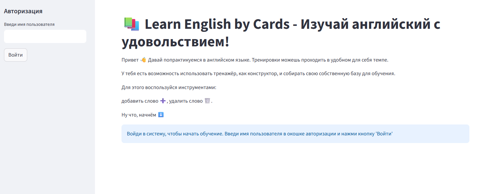
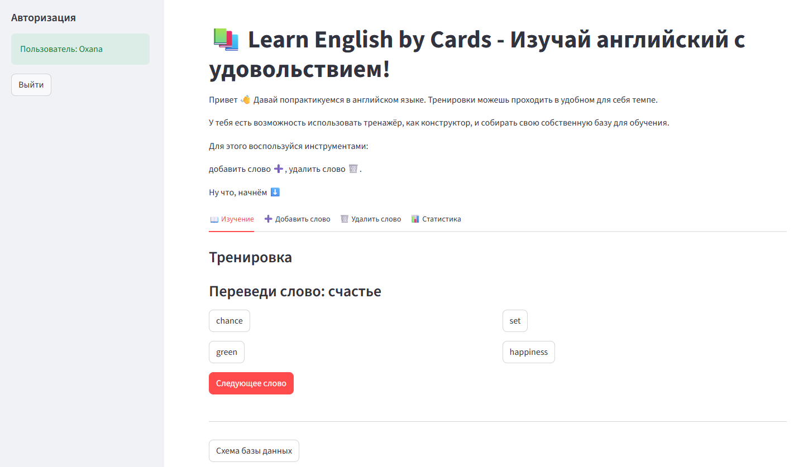

#  Learn English by Cards — Приложение для изучения английского языка 📚
Веб-приложение для изучения английского языка по карточкам слов.

Вместо двух отдельных таблиц `common_words` и `user_words` используется одна таблица `words`, что упрощает поддержку базы данных. 
Поле `is_common = TRUE` означает, что слово доступно всем пользователям, а `user_id IS NOT NULL` — что слово принадлежит конкретному пользователю. 
Такой подход удобен для `get_user_words(user_id)`, потому что позволяет одним запросом получить и общие, и персональные слова.

Первоначальное наполнение БД общим набором слов для всех пользователей происходит из файла `common_words.json`.
Файл содержит только 10 слов, поэтому его чтение происходит целиком, а не построчно или с разбивкой данных на части.
Если для первоначального наполнения будет использоваться другой файл, с большим количеством данных, то нужно будет читать данные частями, чтобы не перегружать память.

Приложение не проверяет пароли и другие механизмы аутентификации — используется только имя пользователя.
Подходит только для учебных приложений или внутренних систем.
Для production-приложений необходимо добавить проверку пароля и полноценную аутентификацию.

## Инструкция по запуску веб-приложения

**1. Установите Python**

Убедитесь, что у вас установлен Python 3.8+

```bash
python --version
```
Если Python не установлен: https://www.python.org/downloads/

**2. Клонируйте репозиторий:**
```bash
git clone git@github.com:Oxanchik/english_cards.git
cd english_cards
```

**3. Создайте и активируйте виртуальное окружение (по желанию):**

Windows:
```bash
python -m venv .venv
.venv\Scripts\activate
```

macOS / Linux:
```bash
python3 -m venv .venv
source .venv/bin/activate
```

**4. Установите зависимости:**
```bash
pip install -r requirements.txt
```

**5. Настройте пароль к Postgres**

Скопируйте файл-пример и переименуйте его в .env
```bash
cp .env.example .env        # macOS/Linux
copy .env.example .env      # Windows
```

Откройте файл .env в любом текстовом редакторе и замените your_password_here на ваш пароль:
```bash
DB_PASS='your_password_here'
```
Также можно заменить логин и название базы данных:
```bash
DB_USER='postgres'
DB_NAME='english_cards'
```

**6. Запустите программу:**
```bash
streamlit run main.py
```

## Пример работы приложения

```bash
You can now view your Streamlit app in your browser.

  Local URL: http://localhost:####                                                                                                                                                  
  Network URL: http://###.###.#.###:####                                                                                                                                            

✅ База данных 'english_cards_db' создана
✅ Таблицы готовы
Заполнено 10 общих слов в таблицу words.
```

### Главная страница с приветствием и боковой панелью авторизации:


### Пример сессии пользователя:



## Описание работы приложения
### Первый запуск
При первом запуске приложение само проверяет существование базы данных, создает её при необходимости, затем создает таблицы и заполняет общие слова из JSON-файла.
После этого открывается главная страница с приветствием и боковой панелью авторизации.

### Авторизация
Имя пользователя вводится в боковой панели и при нажатии кнопки "Войти" открывается сессия пользователя с указанным именем.
Если пользователя с таким именем ещё нет, он автоматически создается; если уже есть - происходит вход под существующим аккаунтом.
После входа становятся доступны вкладки: изучение, добавление слова, удаление слова и статистика.

### Изучение слов
Во вкладке "Изучение" приложение показывает слово на русском и 4 варианта перевода.
Необходимо нажать на правильный вариант: при успехе отображается сообщение "✅ Верно!", а при ошибке: "❌ Неверно. Попробуй ещё раз.".
Кнопка "Следующее слово" генерирует новый вопрос.

### Добавление слова
Во вкладке "Добавить слово" можно ввести русское слово, английский перевод и выбрать часть речи.
Если слово уже есть в общем или в персональном словаре, приложение показывает предупреждение и не добавляет дубликат.
После успешного добавления поля очищаются автоматически, а пользователю показывается текущее количество слов в его тренажёре.

### Удаление слова
Во вкладке "Удалить слово" можно удалять только персональные слова, а общие слова защищены от удаления.
Выбирается слово из списка и при нажатии кнопки "Удалить" слово удаляется из базы данных.
После удаления появляется сообщение об успехе, и список обновляется.

### Статистика
Во вкладке "Статистика" отображаются:
- количество правильных ответов;
- общее число попыток;
- процент точности ответов: отношение правильных ответов к общему числу ответов;
- количество изученных слов.

### Схема базы данных
Ниже вкладок есть кнопка "Схема базы данных".
По клику показывается изображение схемы БД из файла images/English_cards_db_scheme_pgAdmin4.png.

## Технические особенности
Приложение использует `session_state` для хранения текущего пользователя, состояния тренировки и сообщений об успехе/ошибке.
Это позволяет сохранять интерфейс между перерисовками Streamlit и корректно работать с кнопками, формами и `rerun`.
Для базы данных используются три основные таблицы: users, words, user_word_stats.

## Требования
- Python 3.8+ (проверено на 3.14)
- **Зависимости**: все необходимые библиотеки указаны в `requirements.txt`
